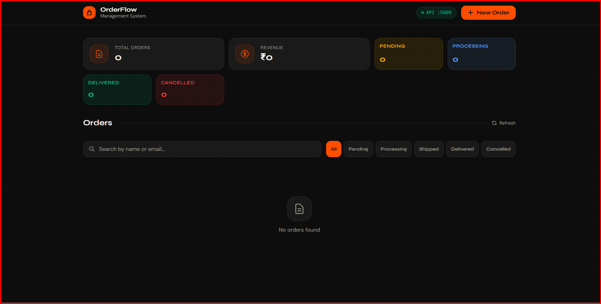

# 🚀 Order Management System

🔗 **Live Demo:** https://frontend-01-gamma.vercel.app/



A simple full-stack **Order Management Dashboard** that simulates a quick delivery workflow.
Built with a clean architecture to demonstrate API design, state management, and frontend-backend integration.

---

## 🧩 Features

* Create new orders
* View all orders
* View single order
* Update order status
* Delete order
* Status lifecycle:
  `pending → processing → out_for_delivery → delivered`
* Simple and responsive dashboard UI

---

## 🛠️ Tech Stack

**Frontend**

* React
* Tailwind CSS
* Axios

**Backend**

* Node.js
* Express

**Database**

* MongoDB (via Mongoose)

---

## 📁 Project Structure

```
order-management-system/
│
├── backend/
│   ├── src/
│   │   ├── routes/
│   │   │   └── orders.js
│   │   ├── controllers/
│   │   │   └── orderController.js
│   │   ├── models/
│   │   │   └── order.js
│   │   └── app.js
│   ├── package.json
│   └── .env
│
├── frontend/
│   ├── public/
│   ├── src/
│   │   ├── components/
│   │   │   ├── OrderList.jsx
│   │   │   ├── OrderForm.jsx
│   │   │   └── OrderItem.jsx
│   │   ├── services/
│   │   │   └── api.js
│   │   ├── App.jsx
│   │   └── index.js
│   └── package.json
│
└── README.md
```

---

## ⚙️ Setup Instructions

### 1. Clone the repositories

**Frontend**

```
git clone https://github.com/rockyhans/frontend_01
```

**Backend**

```
git clone https://github.com/rockyhans/backend_01
```

---

### 2. Setup Backend

```
cd backend
npm install
npm run dev
```

Server runs on:
👉 http://localhost:5000

---

### 3. Setup Frontend

```
cd frontend
npm install
npm start
```

App runs on:
👉 http://localhost:3000

---

## 🔌 API Endpoints

| Method | Endpoint        | Description         |
| ------ | --------------- | ------------------- |
| GET    | /api/orders     | Get all orders      |
| GET    | /api/orders/:id | Get single order    |
| POST   | /api/orders     | Create new order    |
| PUT    | /api/orders/:id | Update order status |
| DELETE | /api/orders/:id | Delete order        |

---

## 🧠 Design Approach

This project is designed as a simplified **quick delivery system**, where orders move through different fulfillment stages.

Focus areas:

* Clean folder structure
* Scalable API design
* Separation of concerns (MVC pattern)

---

## 🚀 Future Improvements

* Add authentication (JWT)
* Integrate maps for delivery tracking
* Real-time order updates (WebSockets)
* Deployment (Cloud hosting)

---

## 👨‍💻 Author

Danish Rizwan
